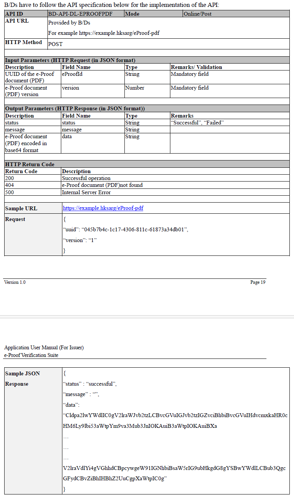

## [POST] /sendOTP
### Send OTP to target eproof user
> Remarks 1: Be careful, the response have a slight different with other API.

> Steps:
> 1. Search Cert_Info from db using UUID and VERSION in request body.
>> e.g. SELECT * FROM CertInfo c left join CertEProof ce on c.id = ce.cert_info_id where ce.uuid = :UUID and ce.version = :version
> 2. After found CertInfo, send OTP email to email of cert_info.email using the OTP in request body.
>> email_template template_name = 'OTP'
> 3. return success message


```typescript
type request_example = {
    uuid: 69b264f4-b365-11ed-afa1-0242ac120002,
    version: 1,
    otp:200990
}

type request = {
    uuid: string,
    version: number,
    otp: string
}

type response = {
    status : "successful",
    message : ""
}

```

## [POST] /eProof-data
### Send e-Proof data to target e-Proof service

> Create this api in ProofController 
> request body (Input Parameters (HTTP Request (in JSON format)))> please **must** follow image below: 
> response body (Output Parameters (HTTP Response (in JSON format))) > please **must** follow image below:
> get data: select e_wallet_json from cert_proof where uuid = :uuid


## [POST] /eProof-pdf
### Send PDF as base64 to target e-Proof service

> Create this api in ProofController
> request body (Input Parameters (HTTP Request (in JSON format)))> please **must** follow image below:
> response body (Output Parameters (HTTP Response (in JSON format))) > please **must** follow image below:
> get data:
select path
from file
left join cert_pdf
on cert_pdf.file_id = file.id
left join cert_eproof
on cert_pdf.cert_info_id = cert_eproof.cert_info_id
where cert_eproof.uuid = 'a9463cd5-1a76-4ba8-883f-c67796521c13'

